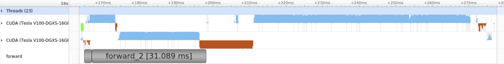
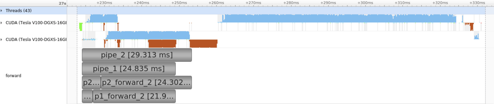

# TF Pipeline Model Parallel Experiments

## What is this

In model parallelism (not data parallelism!), different partitions of the model typically execute sequentially on each GPU. We've seen things like [GPipe (Huang et al., 2018)](https://arxiv.org/abs/1811.06965) that allow the execution to be pipelined, hence keeping each GPU busy instead of waiting for each other. However, the [implementation is pretty complicated](https://github.com/tensorflow/lingvo/blob/master/lingvo/core/gpipe.py). Can we implement something similar using just the tf.keras API? Turns out, sort of.

## Toy Experiment (small CNN model)

In the diagrams below, only the forward pass is annotated with [NVTX](https://github.com/NVIDIA/nvtx-plugins).

**Normal Model Parallel**

Here, `forward_1` and `forward_2` run on different GPUs sequentially.

**Pipeline Model Parallel**

Here, `forward_1` and `forward_2` run on different GPUs. However, the data is partitioned, and the forward pass happens as follows:

1. `data` is split into `data_1` and `data_2`
2. GPU_0 runs `forward_1(data_1)`
3. GPU_0 runs `forward_1(data_2)` while GPU_1 runs `forward_2(data_1)`
2. GPU_1 runs `forward_2(data_2)`

The end result is overlapped execution of the forward pass (and MemCopy too!):

With a simple toy model, the training throughput increase is about 10%.

However, since the backprop part doesn't seem to be getting any speed increase, there isn't much benefit. Perhaps we should start looking at how to do the equivalent for backprop?

